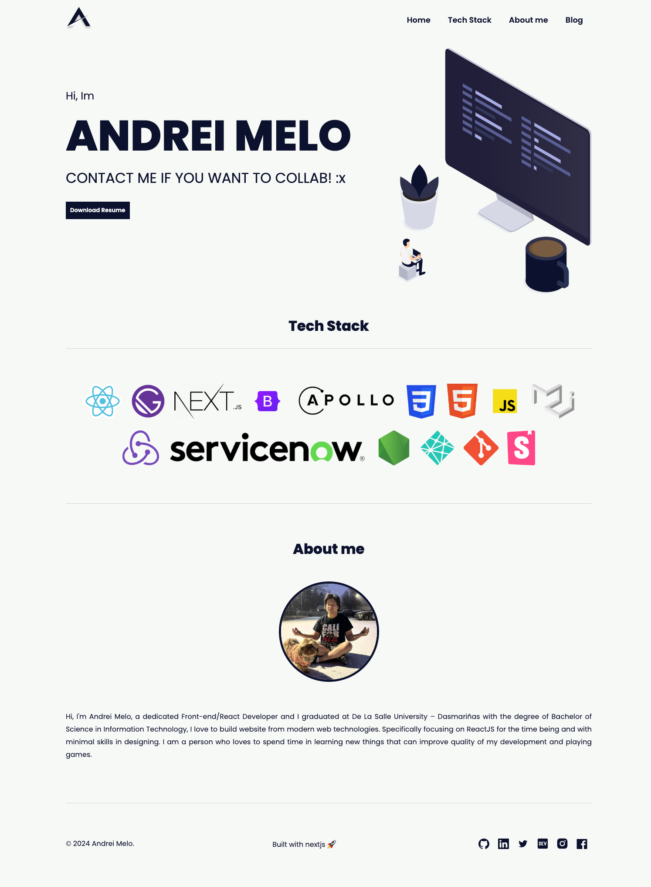

<p align="center">
  <a href="https://andreimelo.netlify.app/">
    
    <h2 align="center">Andrei Melo</h2>
  </a>
</p> 



## Tools Used

To learn more about Next.js, take a look at the following resources:

1. Next.js
2. Css modules

### Run the Project

```bash
yarn start || yarn dev
```

### Build the Project

```bash
yarn build
```

### Export the Project

```bash
yarn export
```

### Deploy on Netlify

-- Only works on main branch

```bash
yarn deploy 
```
